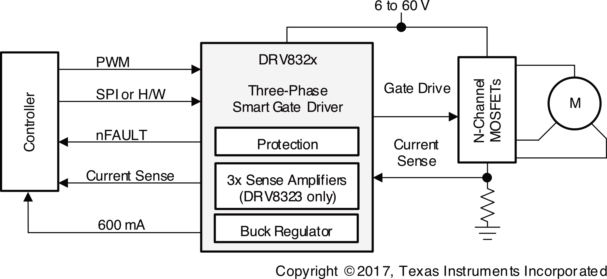
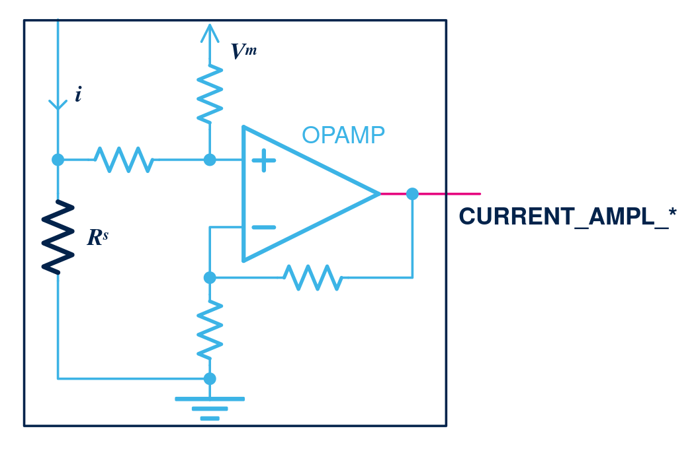

# Field-Oriented Control Drive

A board that controls BLDC motors in robot joints, based on [SimpleFOC Drive Shield](https://github.com/simplefoc/SimpleFOC-DriveShield).

|Feature|Description|
|-|-|
|Current|`20A` continuous, `30A` peak, `75A` max|
|Voltage|`30V` max|
|Encoders|[AS5047D](https://www.digikey.com/en/products/detail/ams-osram-usa-inc/as5047d-atst-tssop14-lf-t-rdp/4896031) (Onboard), [ASKIM2](https://www.rls.si/eng/aksim-2-off-axis-rotary-absolute-encoder) (External)|
|Driver|[DRV8320HRTVT](https://www.digikey.com/en/products/detail/texas-instruments/drv8320hrtvt/7426985) Triple Half-Bridge Gate Driver|
|Communication|[MCP2562FDT-E/MF](https://www.mouser.com/en/ProductDetail/Microchip-Technology/MCP2562FDT-E-MF) CAN-FD Transceiver|
|Power|[XT60PW-F](https://www.aliexpress.us/item/3256808202387933.html)|

## Microcontroller

This board uses [STM32G474RBT3](https://www.digikey.com/en/products/detail/stmicroelectronics/STM32G474RBT3/10326726) MCU.

|Specification|Value|
|-|-|
|Power|`3.3V`|
|Memory|`512 KB` Flash, `96 KB` SRAM|
|ADC|5x 12-bit ADC, up to 16-bit|
|DAC|7x 12-bit DAC|
|Operational Amplifiers|6x|
|Timers|17x|
|Interfaces|`CAN-FD`, `I2C`, `UART`, `SPI`, `USB 2.0`|
|Capabilities|`CORDIC` for Trigonometric Function, `FMAC` Filter Mathematical Accelerator|

## Motor Driver

The [DRV8320HRTVT](https://www.digikey.com/en/products/detail/texas-instruments/drv8320hrtvt/7426985) Triple Half-Bridge Gate Driver with Hardare interface is used to drive three N-channel power MOFSETs.

+ `1.8V`, `3.3V`, and `5V` Logic Inputs
+ Adjustable Slew Rate Control
+ Up to 100% PWM Duty Cycle
+ High-Side Charge Pump
+ Low-SIde Linear Regulator
+ `4V` to `6 V` Operating Voltage
+ `0.8mA` to `600mA` Output Capability

## MOSFETs

The [BSZ0904NSI](https://www.lcsc.com/datasheet/C51908785.pdf) `30V` `60A` N-channel power MOSFETs are used to drive a single 3-phase brushless DC motor.

## Current Sense

Current is sensed by using the [3-Shunt, Amplified Current Sensing](https://wiki.st.com/stm32mcu/wiki/STM32MotorControl:Motor_Control_Boards_Description#Motor-phase-current-sensing) scheme from STM32 user guide:

|Component|Description|
|-|-|
|[HoJLR2512-3W-2mR-1%](https://jlcpcb.com/partdetail/Milliohm-HoJLR2512_3W_2mR_1/C2903471)|`2mΩ` `3W` Current Sense Resistor SMD ±1% 2512 Current Sense Resistors / Shunt Resistors|
|[INA240A1PWR](https://jlcpcb.com/partdetail/TexasInstruments-INA240A1PWR/C93965)|Op-Amps|

## Encoders

The board supports dual encoders:

+ AS5047D on the motor (before gearbox)
+ ASKIM-2 mounted on the drive (after gearbox)

### Onboard Encoder

The onboard AS5047D high-resolution encoder with `SPI` interface is mounted on the board:

|Pin|Signal|
|-|-|
|1|`CS`|
|2|`CLK`|
|3|`MISO`|
|4|`MOSI`|
|11|`5V`|

### External Encoder

The external absolute AKSIM-2 encoder with `SPI` interface uses a 10-pin FCI connector:

|Pin|Signal|
|-|-|
|1|`5V`|
|2|`GND`|
|3|External Temperature Sensor Pin 1 (Pass-Thru)|
|4|External Temperature Sensor Pin 2 (Pass-Thru)|
|5|`SCK`|
|6|`CS`|
|7|`MISO`|
|8|`MOSI`|